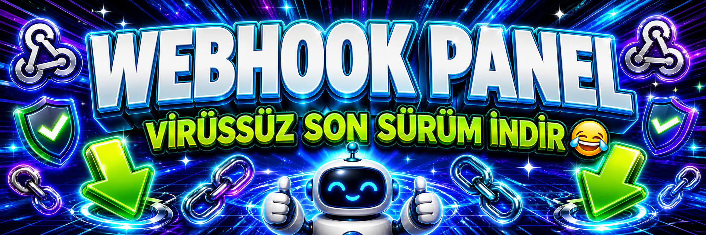

<div align="center">



<br>

# Discord Webhook Panel

**Discord Components V2 arayüzüyle yetkili webhook testleri ve oturum yönetimi.**


[Kurulum](#kurulum) · [Discord ayarları](#discord-ayarları) · [Komutlar](#komutlar) · [Sorun giderme](#sorun-giderme)

</div>

> [!WARNING]
> Bu araç yalnızca sahibi veya açıkça yetkilisi olduğun Discord webhooklarında kontrollü test yapmak içindir. İzinsiz, rahatsız edici ya da hizmeti aksatan kullanımın sorumluluğu kullanıcıya aittir.

## Özellikler

- Discord Components V2 tabanlı buton ve form arayüzü
- Kullanıcı başına ayrı çalışan webhook oturumu
- Gönderim sayısı doğrulaması ve üç saniyelik gönderim aralığı
- Discord `429` yanıtlarında otomatik bekleme
- Bağlantı sıfırlama ve zaman aşımında sınırlı yeniden deneme
- Başlangıç, bitiş ve durdurma için DM bildirimi
- İsteğe bağlı log kanalı ve yönetici kontrollü `.logset` komutu
- Kullanıcının yalnızca kendi oturumunu durdurabilmesi

## Gereksinimler

- Windows 10/11 ve internet bağlantısı (kolay kurulum için)
- Linux/macOS kullanıyorsan [Node.js](https://nodejs.org/) 18 veya üzeri
- Bir Discord uygulaması ve bot tokeni
- Botu ekleyebildiğin bir Discord sunucusu
- Yalnızca sana ait veya kullanım izni verilmiş Discord webhookları

## Kurulum

### Windows'ta kolay kurulum

1. Projeyi ZIP olarak indir ve normal bir klasöre çıkart.
2. [Discord ayarları](#discord-ayarları) bölümündeki adımlarla botunu oluştur ve tokenini hazırla.
3. [`KURULUM.bat`](./KURULUM.bat) dosyasına çift tıkla; yönetici izni istediğinde **Evet** seç.
4. Kurulum Node.js ve npm'i kontrol eder, eksikse güncel Node.js LTS sürümünü `winget` ile kurar.
5. Ayar sihirbazı istediğinde bot tokenini yapıştır. Application ID mümkünse tokenden otomatik bulunur; bulunamazsa ayrıca sorulur.
6. Kurulum paketleri ve Discord bağlantısını test eder, ardından bot davet linkini panoya kopyalayıp tarayıcıda açar.
7. Botu sunucuna ekledikten sonra [`BASLAT.bat`](./BASLAT.bat) dosyasına çift tıkla.

Geçerli bir `config.json` zaten varsa kurulum dosyaya ve tokene dokunmaz. Tamamlanmamış ayarlar yenilenmeden önce eski dosya masaüstündeki `WebhookPanel-Yedekler` klasörüne yedeklenir.

### Kurulum dosyası ne yapıyor?

| İşlem | Otomatik mi? |
| --- | :---: |
| Yönetici izniyle güvenli biçimde yeniden açılma | ✅ |
| Node.js 18+ ve npm sürüm kontrolü | ✅ |
| Node.js eksik/eskiyse güncel LTS kurulumu | ✅ |
| npm paketlerini `package-lock.json` üzerinden temiz kurma | ✅ |
| Bot tokenini konsolda güvenli biçimde alma | ✅ |
| Application ID'yi tokenden bulma | ✅ |
| `config.json` oluşturma ve eski ayarı yedekleme | ✅ |
| JavaScript ve JSON dosyalarını kontrol etme | ✅ |
| Discord bot tokenini canlı bağlantıyla doğrulama | ✅ |
| Bot davet linkini panoya kopyalayıp açma | ✅ |
| Discord uygulaması/botu oluşturma | ❌ Elle yapılır |

### Terminal ile kurulum

```powershell
npm install
npm run setup
npm run check
npm start
```

Linux veya macOS üzerinde kopyalama komutu:

```bash
npm install
npm run setup
npm run check
npm start
```

## Discord ayarları

<div align="center">

<a href="https://youtu.be/UCAB3eddylU">
  
</a>

**🎥 Bot Tokeni Nasıl Alınır? — İzlemek için kapağa tıkla**

</div>

1. [Discord Developer Portal](https://discord.com/developers/applications) sayfasında **New Application** ile bir uygulama oluştur.
2. **Bot** bölümünden botu oluştur ve tokenini al.
3. Aynı sayfadaki **Privileged Gateway Intents** bölümünde **Message Content Intent** seçeneğini aç.
4. `KURULUM.bat` dosyasını çalıştır ve bot tokenini ayar sihirbazına yapıştır.
5. Kurulumun sonunda açılan davet sayfasında sunucunu seçip botu ekle.

Bu projede slash komut bulunmadığı için `applications.commands`, Presence Intent ve Server Members Intent zorunlu değildir. Botun Administrator veya Manage Webhooks iznine de ihtiyacı yoktur; webhook oluşturmaz, forma girilen mevcut webhook adresine gönderim yapar.

## Yapılandırma

Paylaşılabilir örnek [`config.example.json`](./config.example.json) dosyasında bulunur:

```json
{
  "token": "DISCORD_BOT_TOKENINI_BURAYA_YAZ",
  "clientId": "DISCORD_UYGULAMA_ID"
}
```

| Alan | Zorunlu | Açıklama |
| --- | :---: | --- |
| `token` | Evet | Discord Developer Portal'dan alınan gizli bot tokeni |
| `clientId` | Evet | Davet bağlantısı ve token eşleştirme kontrolü için kullanılan Discord Application ID; sihirbaz bunu genellikle tokenden bulur |

`config.json` gizli bilgi içerir ve `.gitignore` kapsamındadır. Gerçek tokeni README'ye, ekran görüntüsüne veya GitHub'a ekleme. Token daha önce paylaşılmışsa Developer Portal'daki **Bot → Reset Token** seçeneğiyle hemen yenile.

## İlk kullanım

1. Botu başlat.
2. Sunucuda `.logset #log-kanalı` yazarak isteğe bağlı log kanalını ayarla.
3. `.webhookpnl` komutuyla paneli gönder.
4. **Webhook Spam Başlat** düğmesinden sana ait webhook adresini, mesajı ve gönderim sayısını gir.
5. Paneldeki durdurma düğmesiyle kendi aktif oturumunu sonlandırabilirsin.

Log kanalı ve aktif oturumlar bellekte tutulur. Bot yeniden başladığında bu bilgiler sıfırlanır; log kanalını yeniden ayarlaman gerekir.

## Komutlar

| Komut | Yetki | Açıklama |
| --- | --- | --- |
| `.webhookpnl` | Herkes | Webhook test ve oturum panelini açar. |
| `.webhookpanel` / `.whpnl` | Herkes | Panel komutunun alternatif adlarıdır. |
| `.logset #kanal` | Yönetici | Çalışma süresince kullanılacak log kanalını ayarlar. |
| `.logchannel` / `.setlog` | Yönetici | Log komutunun alternatif adlarıdır. |

## npm komutları

```powershell
npm run setup  # Tokeni alan ve config.json oluşturan ayar sihirbazı
npm run check  # Node.js, paketler, config ve JavaScript söz dizimi kontrolü
npm start      # Botu başlatır
```

## Proje yapısı

```text
webhook/
├─ commands/                  # Mesaj komutları
│  ├─ logset.js
│  └─ webhookpnl.js
├─ handlers/
│  └─ interactionHandler.js  # Buton, modal ve gönderim oturumları
├─ scripts/
│  ├─ kurulum.js             # Elle token alan ayar sihirbazı
│  ├─ kurulum-tamamlandi.js  # Davet linkini hazırlayıp açar
│  └─ sistem-kontrol.js      # Dosya ve Discord bağlantı kontrolleri
├─ utils/                     # Yardımcı modüller
├─ config.example.json       # Paylaşılabilir ayar örneği
├─ KURULUM.bat               # Windows kurulum yardımcısı
├─ BASLAT.bat                # Windows başlatıcısı
└─ index.js                  # Uygulamanın giriş noktası
```

## Sorun giderme

<details>
<summary><strong>Cannot find module 'discord.js' veya 'axios'</strong></summary>

Proje klasöründe `npm install` çalıştır veya `KURULUM.bat` dosyasını yeniden aç.

</details>

<details>
<summary><strong>Used disallowed intents veya bot komutları okumuyor</strong></summary>

Developer Portal'daki bot ayarlarından **Message Content Intent** seçeneğini aç. Ardından botu yeniden başlat.

</details>

<details>
<summary><strong>An invalid token was provided</strong></summary>

`config.json` içindeki `token` değerini kontrol et. Tokeni yenilediysen eski değer çalışmaz; yeni değeri kaydedip botu yeniden başlat.

</details>

<details>
<summary><strong>Panel veya log mesajı gönderilemiyor</strong></summary>

Botun ilgili kanalda **View Channels**, **Send Messages** ve **Read Message History** izinlerinin bulunduğunu kontrol et.

</details>

<details>
<summary><strong>Bot yeniden başlayınca log kanalı ve oturumlar kayboldu</strong></summary>

Bu bilgiler mevcut sürümde yalnızca bellekte tutulur. Yeniden başladıktan sonra `.logset #kanal` komutunu tekrar kullan; yarım kalan gönderim oturumları otomatik devam etmez.

</details>

## Güvenlik

- `config.json` ve bot tokenini kimseyle paylaşma.
- Webhook URL'si de gizli bir kimlik bilgisi gibi korunmalıdır; URL'yi gören kişi webhook üzerinden mesaj gönderebilir.
- Yalnızca kendi webhooklarını veya açıkça test izni verilen hedefleri kullan.
- Kontrolsüz yüksek hacimli gönderim Discord rate-limitlerine, webhookun silinmesine veya hesabın kısıtlanmasına yol açabilir.
- Şüpheli durumda bot tokenini yenile ve etkilenen webhooku silip yeniden oluştur.

## Lisans

Bu proje özel **Webhook Panel Source-Available License 1.0** ile paylaşılır:

- Kişisel, eğitim amaçlı, kurum içi veya daha büyük projelerde ücretsiz kullanılabilir ve değiştirilebilir.
- Yazılımın kendisi, esaslı bir kopyası veya benzer türevi satılamaz; kiralanamaz ya da ücretli erişime konulamaz.
- Herkese açık paylaşım, fork ve türev projelerde `Original project by oksicim — https://github.com/oksicim` atfı görünür biçimde bulunmalıdır.
- Ayrıntılı ve bağlayıcı koşullar için [`LICENSE`](./LICENSE) dosyasını oku.
